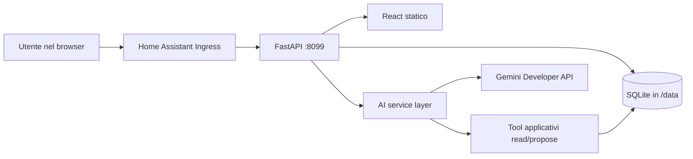

# RicettAIo — specifiche di prodotto e architettura

> Stato: approvata per l'implementazione
> Data: 25 settembre 2026
> Nome di lavoro: **RicettAIo** (`ricettaio` come slug tecnico)

## 1. Sintesi

RicettAIo è un ricettario personale assistito dall'AI, installabile come **app di Home Assistant** (in precedenza chiamata add-on) e accessibile dal menu laterale tramite Ingress.

L'app deve restare utile anche senza AI: consultazione, ricerca, creazione, modifica, eliminazione, ridimensionamento delle dosi ed esportazione delle ricette funzionano localmente. Gemini aggiunge conversazione, creazione guidata, variazioni e importazione assistita, ma non diventa la fonte autorevole dei dati e non può effettuare modifiche distruttive senza conferma esplicita.

### Decisioni consigliate

| Tema | Decisione iniziale | Motivazione |
|---|---|---|
| Nome | **RicettAIo** | Richiama chiaramente “ricettario” e AI; da verificare come marchio/dominio prima di una pubblicazione commerciale |
| Distribuzione | Una sola app/container Home Assistant | Installazione e backup semplici; frontend e backend hanno lo stesso ciclo di rilascio |
| Frontend | React + TypeScript + Vite | SPA leggera, ecosistema maturo, build statica |
| Backend | Python + FastAPI + Pydantic | API tipizzate e integrazione naturale con SDK Gemini |
| Persistenza | SQLite come fonte autorevole | Transazioni, migrazioni, ricerca e backup senza doppia fonte di verità |
| Portabilità | Export/import JSON versionato | Leggibilità e migrazione senza usare JSON come database operativo |
| AI | Gemini Developer API tramite SDK ufficiale | Structured output e function calling sono sufficienti e più controllabili di una CLI agentica |
| Ricerca AI | SQLite FTS5 + recupero puntuale | Semplice, locale e adeguato a un ricettario personale; embeddings rinviati |
| Backup HA | Backup `cold` iniziale | Garantisce una copia SQLite coerente fermando brevemente l'app |
| Accesso | Home Assistant Ingress, nessuna porta pubblicata | Autenticazione delegata a Home Assistant e superficie esposta minima |

## 2. Obiettivi e criteri di successo

### Obiettivi

1. Conservare e organizzare un ricettario personale in modo affidabile.
2. Trovare rapidamente una ricetta per testo, categoria, tag e caratteristiche.
3. Adattare automaticamente le quantità al numero di porzioni.
4. Creare o variare ricette tramite una conversazione naturale.
5. Permettere all'AI di usare le ricette esistenti come contesto senza inviare sempre l'intero archivio.
6. Installarsi, aggiornarsi e includere i dati nei normali backup di Home Assistant.
7. Rendere sempre visibili e confermabili le modifiche proposte dall'AI.

### Indicatori iniziali

- Una ricetta manuale completa può essere inserita in meno di 3 minuti.
- Ricerca e apertura di una ricetta locale rispondono normalmente in meno di 300 ms su hardware Home Assistant tipico.
- Nessuna operazione AI crea, sovrascrive o elimina dati senza una conferma nell'interfaccia.
- Un'interruzione dell'API Gemini non impedisce l'uso manuale del ricettario.
- Backup, ripristino ed export conservano integralmente ricette, categorie, tag e revisioni.

## 3. Ambito delle versioni

### MVP / versione 1

- Home con elenco ricette, raggruppamento opzionale e vista griglia/lista.
- Ricerca full-text locale.
- Filtri per categoria, tag, difficoltà, tempo massimo e preferiti.
- Ordinamento per titolo, data di modifica, data di creazione e tempo totale.
- CRUD manuale delle ricette.
- Dettaglio ricetta con ridimensionamento delle dosi.
- Categorie iniziali modificabili: antipasti, primi, secondi, contorni, piatti unici, dolci, bevande, salse e altro.
- Tag liberi, preferiti e note.
- Chat globale con accesso controllato alle ricette.
- Chat contestuale a una singola ricetta.
- Creazione guidata e proposta di modifica via AI.
- Conferma esplicita di creazione, modifica ed eliminazione.
- Configurazione Gemini, test della connessione e limiti d'uso di base.
- Storico revisioni con ripristino.
- Duplicazione manuale di una ricetta e salvataggio delle varianti AI come nuova ricetta.
- Export/import JSON e backup Home Assistant.
- Interfaccia responsive in italiano; struttura pronta per internazionalizzazione.

### Versione 1.1 consigliata

- Foto della ricetta e immagine di copertina.
- Modalità cucina: schermo sempre attivo, un passaggio alla volta e timer.
- Confronto avanzato tra revisioni storiche, oltre al diff della proposta AI già presente nell'MVP.
- Stampa/PDF.
- PWA solo se offre un vantaggio concreto dentro Ingress.
- Deduplicazione ingredienti e suggerimenti durante la digitazione.

### Versione 2

- Importazione da pagina web pubblica.
- Importazione da video/file o URL YouTube, con revisione obbligatoria.
- Lista della spesa e aggregazione delle quantità.
- Pianificazione dei pasti.
- Filtri nutrizionali e calcolo nutrizionale tramite fonte affidabile.
- Integrazioni Home Assistant, per esempio timer o notifiche, solo con permessi espliciti.
- Profili o proprietà per utente, se emerge l'esigenza di separare i ricettari.
- Ricerca semantica con embeddings solo se FTS5 non è più sufficiente.

### Fuori ambito iniziale

- Social network, condivisione pubblica o marketplace di ricette.
- Autonomia dell'AI su shell, filesystem o rete locale.
- Scraping general-purpose e aggiramento di paywall/login.
- Stima automatica di allergeni o valori nutrizionali presentata come certezza.
- Sincronizzazione cloud proprietaria.
- Supporto a installazioni Docker di Home Assistant prive di Supervisor: le app gestite richiedono Home Assistant OS o una configurazione con Supervisor compatibile.

## 4. Utenti, accesso e proprietà dei dati

Per l'MVP il ricettario è **condiviso a livello di istanza Home Assistant**. Tutti gli utenti HA autorizzati ad aprire il pannello vedono lo stesso archivio. È la scelta più coerente con l'uso domestico e non richiede un secondo sistema di autenticazione.

- Ingress autentica l'accesso prima che la richiesta raggiunga l'app.
- `panel_admin: false` rende il pannello disponibile anche agli utenti HA non amministratori; questa scelta va confermata durante l'implementazione.
- L'app non pubblica porte sull'host per l'uso normale.
- Non si assume che l'identità Home Assistant ricevuta via Ingress sia una base stabile per l'autorizzazione applicativa. La separazione per utente resta quindi fuori dall'MVP.
- Se in futuro servono ruoli, ricette private o audit per persona, si progetterà esplicitamente l'integrazione con l'identità HA.

## 5. Esperienza utente

### 5.1 Home / archivio

La home contiene:

- intestazione con nome dell'app, ricerca e pulsante “Nuova ricetta”;
- accesso alla chat globale;
- filtri richiudibili su mobile;
- contatore dei risultati e comando di ordinamento;
- griglia/lista di card con titolo, categoria, tempo totale, difficoltà, preferito ed eventuale immagine;
- raggruppamento opzionale per categoria;
- stato vuoto con invito a creare manualmente o con AI;
- indicatori separati per “nessuna ricetta” e “nessun risultato per i filtri”.

La ricerca copre almeno titolo, descrizione, ingredienti, passaggi, tag, cucina e note. I filtri sono combinabili e riflessi nell'URL o nello stato navigabile, così da sopravvivere al ritorno dal dettaglio.

### 5.2 Creazione manuale

Il form è diviso in sezioni:

1. informazioni principali;
2. porzioni e tempi;
3. ingredienti, riordinabili e raggruppabili;
4. passaggi, riordinabili;
5. classificazione e tag;
6. note, fonte e metadati opzionali.

Requisiti UX:

- salvataggio possibile con il minimo: titolo, almeno un ingrediente e almeno un passaggio;
- quantità non obbligatoria per ingredienti come “sale q.b.”;
- avviso prima di abbandonare modifiche non salvate;
- validazione vicino al campo, non solo al submit;
- anteprima delle dosi per un numero diverso di porzioni;
- categorie e unità suggerite, non rigidamente imposte.

### 5.3 Creazione con AI

Il flusso non salva direttamente una risposta testuale:

1. l'utente descrive la ricetta o l'obiettivo;
2. l'AI chiede solo le informazioni mancanti davvero importanti;
3. il backend richiede un `RecipeDraft` strutturato;
4. il frontend mostra una scheda di anteprima modificabile;
5. validazione applicativa e segnalazione dei campi dubbi;
6. l'utente conferma “Salva ricetta”.

Il draft può essere modificato sia a mano sia continuando la conversazione. Ogni informazione inferita deve poter essere corretta prima del salvataggio.

### 5.4 Dettaglio ricetta

Mostra:

- titolo, descrizione, categoria, tag e preferito;
- porzioni base e selettore delle porzioni desiderate;
- tempi di preparazione, cottura, riposo e totale;
- difficoltà;
- ingredienti raggruppati e quantità ricalcolate;
- passaggi numerati con eventuale durata, temperatura e nota;
- attrezzatura, note, fonte e data di aggiornamento;
- azioni: modifica, duplica, elimina, cronologia e chat sulla ricetta.

L'eliminazione manuale usa una conferma chiara. È preferibile un **soft delete** con cestino/ripristino, seguito da eliminazione definitiva dopo un periodo configurabile; per l'MVP il periodo proposto è 30 giorni.

### 5.5 Chat globale

Esempi di richieste:

- “Quali ricette posso fare in meno di 30 minuti?”
- “Ho zucchine e ricotta: cosa c'è già nel mio ricettario?”
- “Proponimi un menu usando soprattutto le mie ricette.”
- “Crea una variante vegetariana della lasagna.”

La risposta indica quali ricette locali ha consultato e offre link interni. Se nasce una nuova ricetta o una variazione, viene prodotta come proposta, non salvata automaticamente.

### 5.6 Chat della ricetta

La chat riceve la versione corrente della ricetta come contesto. Può:

- spiegare un passaggio;
- adattare porzioni o ingredienti;
- proporre sostituzioni;
- trasformare la ricetta per una preferenza alimentare;
- proporre una patch strutturata;
- preparare una copia/variante invece di sovrascrivere l'originale.

La UI mostra un diff leggibile prima dell'applicazione: campi aggiunti, rimossi e modificati. Se nel frattempo la ricetta è cambiata, la patch viene rifiutata con conflitto di versione e va rigenerata o riconciliata.

## 6. Formato canonico della ricetta

### 6.1 Principi

- Il numero di porzioni base è obbligatorio e maggiore di zero.
- Le quantità numeriche vengono memorizzate separatamente dall'unità per consentire il ridimensionamento.
- È ammesso un testo quantità (`q.b.`, `una manciata`) quando il valore numerico non ha senso.
- Alcune quantità non scalano linearmente: ogni ingrediente ha `scalable`.
- Il testo originale/importato può essere conservato in `original_text` per trasparenza.
- Le unità non vengono convertite automaticamente nell'MVP; vengono solo scalate. La conversione g↔kg può essere una funzione di presentazione successiva.
- Categoria principale e tag sono concetti distinti: la prima organizza, i secondi descrivono.
- Allergeni e preferenze alimentari sono metadati espliciti e non garanzie mediche.
- Tutti gli ID sono UUID; le date sono ISO 8601 UTC.

### 6.2 Campi

| Campo | Tipo | Obbligatorio | Note |
|---|---:|:---:|---|
| `id` | UUID | sì | Generato dal backend |
| `schema_version` | intero | sì | Versione del formato export/API |
| `title` | stringa | sì | 1–200 caratteri |
| `slug` | stringa | sì | Solo per URL leggibile; l'ID resta l'identificatore |
| `description` | stringa/null | no | Sintesi breve |
| `category_id` | UUID/null | no | Categoria principale |
| `cuisine` | stringa/null | no | Es. italiana, messicana |
| `difficulty` | enum/null | no | `easy`, `medium`, `hard` |
| `base_servings` | decimale | sì | Es. 4 persone o 12 pezzi |
| `serving_unit` | stringa | sì | `persone`, `pezzi`, `porzioni`… |
| `prep_time_minutes` | intero/null | no | ≥ 0 |
| `cook_time_minutes` | intero/null | no | ≥ 0 |
| `rest_time_minutes` | intero/null | no | ≥ 0 |
| `ingredients` | array | sì | Almeno un elemento |
| `steps` | array | sì | Almeno un elemento |
| `equipment` | array di stringhe | no | Attrezzatura utile |
| `tags` | array | no | Tag gestiti separatamente nel DB |
| `dietary_labels` | array | no | Dichiarazioni dell'utente, non inferenze certe |
| `allergens` | array | no | Da mostrare con avvertenza |
| `notes` | stringa/null | no | Note personali |
| `source` | oggetto/null | no | Origine e attribuzione |
| `favorite` | booleano | sì | Default `false` |
| `created_at`, `updated_at` | datetime | sì | Gestiti dal backend |
| `revision` | intero | sì | Controllo concorrenza, parte da 1 |

### 6.3 Ingrediente

| Campo | Tipo | Note |
|---|---:|---|
| `id` | UUID | Identità stabile anche nel diff |
| `group` | stringa/null | Es. “Per l'impasto” |
| `name` | stringa | Nome visualizzato |
| `quantity` | stringa decimale/null | `"0.5"`, non float binario |
| `unit` | stringa/null | Es. `g`, `ml`, `cucchiaio` |
| `quantity_text` | stringa/null | Es. `q.b.`; prevale nella visualizzazione se presente |
| `preparation` | stringa/null | Es. “tritate finemente” |
| `optional` | booleano | Default `false` |
| `scalable` | booleano | Default `true` |
| `sort_order` | intero | Ordine esplicito |
| `original_text` | stringa/null | Utile per import e audit AI |

Formula di scala, solo se `quantity != null` e `scalable == true`:

```text
quantità_visualizzata = quantità_base × porzioni_richieste / porzioni_base
```

L'arrotondamento è solo di presentazione e deve produrre valori culinariamente leggibili (per esempio 0,5 o ½); il valore salvato non cambia.

### 6.4 Passaggio

| Campo | Tipo | Note |
|---|---:|---|
| `id` | UUID | Identità stabile |
| `title` | stringa/null | Titolo breve opzionale |
| `instruction` | stringa | Istruzione completa |
| `duration_minutes` | intero/null | Per timer futuro |
| `temperature_celsius` | intero/null | Solo quando rilevante |
| `sort_order` | intero | Ordine esplicito |

### 6.5 Fonte

```json
{
  "type": "manual",
  "url": null,
  "title": null,
  "author": null,
  "accessed_at": null,
  "license_note": null
}
```

`type` può essere `manual`, `ai`, `website`, `video`, `book` o `other`. Per gli import si conserva la provenienza; non si copiano automaticamente testi o immagini oltre ciò che è lecito e necessario.

### 6.6 Esempio compatto

```json
{
  "id": "7eab6a60-8f15-4e7a-9e87-47c252ac91ca",
  "schema_version": 1,
  "title": "Pasta e ceci",
  "slug": "pasta-e-ceci",
  "description": "Versione cremosa da dispensa",
  "category_id": "64814e43-ff6e-4a67-a390-5f576e27c02e",
  "cuisine": "italiana",
  "difficulty": "easy",
  "base_servings": "4",
  "serving_unit": "persone",
  "prep_time_minutes": 10,
  "cook_time_minutes": 30,
  "rest_time_minutes": null,
  "ingredients": [
    {
      "id": "25d88f66-3b21-45fd-9072-e8688d8d9882",
      "group": null,
      "name": "ceci cotti",
      "quantity": "480",
      "unit": "g",
      "quantity_text": null,
      "preparation": "scolati",
      "optional": false,
      "scalable": true,
      "sort_order": 1,
      "original_text": "480 g di ceci cotti, scolati"
    },
    {
      "id": "79c823bb-4080-4cee-b869-ab9717bb65f8",
      "group": null,
      "name": "sale",
      "quantity": null,
      "unit": null,
      "quantity_text": "q.b.",
      "preparation": null,
      "optional": false,
      "scalable": false,
      "sort_order": 2,
      "original_text": "sale q.b."
    }
  ],
  "steps": [
    {
      "id": "2a379b01-c86c-422a-ac85-281c03cb44db",
      "title": "Base",
      "instruction": "Scalda i ceci con gli aromi e una parte della loro acqua.",
      "duration_minutes": 10,
      "temperature_celsius": null,
      "sort_order": 1
    }
  ],
  "equipment": ["pentola", "frullatore a immersione"],
  "tags": ["dispensa", "vegetariano"],
  "dietary_labels": ["vegetariano"],
  "allergens": ["glutine"],
  "notes": null,
  "source": {"type": "manual", "url": null},
  "favorite": true,
  "created_at": "2026-09-25T10:00:00Z",
  "updated_at": "2026-09-25T10:00:00Z",
  "revision": 1
}
```

## 7. Persistenza e modello dati

### 7.1 Scelta: solo SQLite come fonte autorevole

Non si consiglia “file JSON + SQLite come indice”: introduce sincronizzazione, aggiornamenti parziali e due possibili verità. SQLite gestisce bene un archivio personale, supporta transazioni e FTS5 ed è semplice da includere nei backup.

Percorsi proposti:

```text
/data/ricettaio.db          database
/data/uploads/              immagini o file persistenti futuri
/data/exports/              export richiesti dall'utente, eliminabili
/data/options.json          configurazione gestita dal Supervisor
```

### 7.2 Tabelle principali

- `recipes`: campi principali, soft delete, versione e timestamp.
- `ingredients`: ingredienti ordinati e raggruppati.
- `steps`: passaggi ordinati.
- `categories`: categorie modificabili con nome, colore e ordine.
- `tags` e `recipe_tags`: relazione molti-a-molti.
- `recipe_revisions`: snapshot JSON canonico, autore (`manual`/`ai`/`import`) e motivazione.
- `conversations`: tipo `global` o `recipe`, eventuale `recipe_id`, titolo e timestamp.
- `messages`: ruolo, contenuto, metadati tool e consumo token essenziale.
- `ai_proposals`: draft/patch/delete, stato, revisione di base, scadenza.
- `settings`: sole preferenze applicative non segrete e versione schema.
- `import_jobs`: stato e diagnostica degli import futuri.
- tabella virtuale FTS5 per titolo, descrizione, ingredienti, passaggi, tag e note.

Le revisioni non devono duplicare indefinitamente dati: politica iniziale suggerita, ultime 50 revisioni per ricetta, configurabile in seguito. Il cestino usa `deleted_at`; la pulizia definitiva è una manutenzione esplicita.

### 7.3 Migrazioni

- Alembic o un migratore equivalente eseguito all'avvio prima di servire traffico.
- Migrazioni solo in avanti per ogni release; il backup precede gli aggiornamenti importanti.
- `PRAGMA foreign_keys=ON`.
- WAL è utile durante il funzionamento, ma il backup `cold` semplifica la consistenza.
- Shutdown ordinato con checkpoint WAL e chiusura delle connessioni.
- Test automatico di migrazione da ogni versione di DB ancora supportata.

### 7.4 Export/import

L'export è un archivio JSON UTF-8 con:

- `export_version`;
- data e versione app;
- ricette nel formato canonico;
- categorie e tag;
- opzione separata per includere revisioni e conversazioni;
- checksum degli eventuali allegati.

La chiave Gemini non viene mai inclusa nell'export applicativo. L'import valida schema e dimensioni, mostra un riepilogo e offre strategie `skip`, `duplicate` o `replace` per i conflitti.

## 8. Architettura applicativa



### 8.1 Monorepo proposto

```text
/
├── ricettaio/               build context dell'app Home Assistant
│   ├── config.yaml
│   ├── Dockerfile
│   ├── run.sh
│   ├── apparmor.txt
│   ├── DOCS.md
│   ├── CHANGELOG.md
│   ├── translations/
│   ├── backend/
│   │   ├── app/
│   │   └── tests/
│   └── frontend/
│       └── src/
├── LICENSE
├── README.md
└── SPECIFICHE.md
```

### 8.2 Responsabilità

**Frontend**

- presentazione, form, stato locale, diff e conferme;
- nessuna chiamata diretta a Gemini;
- API sempre tramite percorso relativo compatibile con Ingress;
- Hash Router consigliato nell'MVP per evitare problemi di refresh sotto il prefisso dinamico di Ingress.

**Backend**

- regole di dominio e validazione;
- CRUD, ricerca, revisioni, import/export;
- orchestrazione AI e applicazione sicura delle proposte;
- servizio degli asset React e fallback della SPA;
- health check e log strutturati senza contenuti sensibili.

**AI service layer**

- astrae il provider dal dominio;
- costruisce prompt e tool;
- valida ogni output con Pydantic;
- applica timeout, retry limitato, limiti per conversazione e telemetria costi;
- non possiede accesso generico a DB, filesystem, shell o rete.

## 9. API applicativa indicativa

Prefisso relativo: `api/v1` (senza slash assoluto nel frontend, per rispettare il prefisso Ingress).

### Ricette

- `GET api/v1/recipes` — ricerca, filtri, paginazione e ordinamento.
- `POST api/v1/recipes` — creazione manuale o conferma di un draft.
- `GET api/v1/recipes/{id}` — dettaglio.
- `PUT api/v1/recipes/{id}` — sostituzione con controllo `revision`.
- `PATCH api/v1/recipes/{id}` — modifica parziale con controllo `revision`.
- `DELETE api/v1/recipes/{id}` — spostamento nel cestino.
- `POST api/v1/recipes/{id}/restore` — ripristino.
- `GET api/v1/recipes/{id}/revisions` — cronologia.
- `POST api/v1/recipes/{id}/revisions/{revision}/restore` — ripristino come nuova revisione.

### Tassonomia e sistema

- `GET/POST/PATCH/DELETE api/v1/categories`.
- `GET/POST/DELETE api/v1/tags`.
- `GET api/v1/health` — stato applicazione e DB, senza segreti.
- `GET api/v1/settings` e `PATCH api/v1/settings` — preferenze non gestite dal pannello app HA.
- `POST api/v1/ai/test` — test configurazione Gemini.
- `GET api/v1/export` e `POST api/v1/import`.

### Conversazioni e proposte

- `POST api/v1/conversations` — globale o legata a ricetta.
- `GET api/v1/conversations/{id}`.
- `POST api/v1/conversations/{id}/messages` — risposta in streaming SSE.
- `POST api/v1/ai/drafts` — crea/aggiorna un draft strutturato.
- `POST api/v1/ai/proposals/{id}/apply` — applica dopo conferma e controllo revisione.
- `DELETE api/v1/ai/proposals/{id}` — rifiuta/scarta.

Errori in un formato coerente, per esempio Problem Details, con `request_id`. Paginazione a cursore o `limit/offset`; per l'MVP `limit/offset` è sufficiente.

## 10. Progettazione dell'AI

### 10.1 API Gemini, non Antigravity CLI nel container

Il requisito è un assistente verticale con un insieme piccolo di azioni note. Gemini offre già output JSON vincolato da schema e function calling: il backend può esporre solo strumenti sicuri e validare tutto.

Installare Antigravity CLI nel container di produzione è sconsigliato perché:

- è un agente di sviluppo generalista, non il runtime naturale del prodotto;
- aumenterebbe immagine, dipendenze, credenziali e superficie d'attacco;
- renderebbe più difficile limitare filesystem, shell e rete;
- complicherebbe aggiornamenti, riproducibilità e supporto multi-architettura;
- le sue quote/credenziali non sostituiscono necessariamente la fatturazione della Gemini API.

Antigravity può essere usato **durante lo sviluppo**, fuori dall'app distribuita. Il runtime usa l'SDK Python ufficiale `google-genai` e una API key dedicata con restrizioni e budget dove disponibili.

### 10.2 Nota su Google AI Pro

L'abbonamento consumer Google AI Pro offre benefici nei prodotti Google, AI Studio e Antigravity, ma non va assunto come credito indistinto per una propria applicazione. La Gemini Developer API ha progetto, chiavi, quote e fatturazione propri. Prima dell'implementazione va creato un progetto in AI Studio, generata una chiave dedicata e verificato il tier effettivo.

### 10.3 Modelli

Non codificare il prodotto attorno al nome di un modello preview. Configurazione proposta:

- `gemini_model_fast`: modello Flash stabile disponibile al momento del rilascio, per chat e operazioni comuni;
- `gemini_model_quality`: modello di qualità superiore opzionale, per import/trasformazioni difficili;
- timeout, massimi token e budget giornaliero configurabili;
- elenco di modelli compatibili testato per release.

Il default preciso viene scelto in implementazione dopo una piccola valutazione su un dataset di ricette italiane. Una preview non deve essere il solo modello supportato.

### 10.4 Tool interni

Strumenti leggibili dal modello:

- `search_recipes(query, filters, limit)` — restituisce ID e sintesi.
- `get_recipe(recipe_id)` — restituisce il formato canonico.
- `list_categories()` e `list_tags()`.
- `create_recipe_draft(recipe)` — registra solo una proposta.
- `propose_recipe_patch(recipe_id, base_revision, patch, rationale)`.
- `propose_recipe_deletion(recipe_id, base_revision, rationale)`.

Il modello **non riceve** un tool `execute_sql`, `write_file`, `run_shell` o una cancellazione diretta. Gli strumenti di scrittura producono oggetti `pending`; solo un endpoint chiamato dall'azione di conferma dell'utente può applicarli.

### 10.5 Recupero del contesto

Chat globale:

1. interpreta la richiesta e chiama `search_recipes`;
2. riceve pochi candidati con metadati;
3. chiama `get_recipe` solo per quelli necessari;
4. risponde citando titoli/ID consultati.

Chat ricetta:

- include la ricetta corrente completa, la sua revisione e una finestra limitata dei messaggi;
- recupera altre ricette solo se richiesto;
- riassume i turni vecchi quando la conversazione cresce.

Non si invia l'intero database a ogni messaggio. Non serve un vector DB nell'MVP: FTS5, filtri strutturati e tool calling sono più facili da verificare. Embeddings diventano utili solo dopo test comparativi su query semantiche reali.

### 10.6 Structured output e validazione

Usare schemi Pydantic distinti:

- `RecipeDraft` per creazione/import;
- `RecipePatchProposal` per variazioni;
- `DeleteProposal` per cancellazione;
- `AssistantAnswer` per testo, riferimenti e azioni proposte.

La conformità JSON non garantisce correttezza culinaria. Dopo l'output AI il backend verifica almeno:

- campi obbligatori e limiti;
- quantità non negative e porzioni > 0;
- ID e revisione esistenti;
- unità e durate plausibili senza correggerle in silenzio;
- assenza di campi sconosciuti;
- dimensione massima di testo e array;
- patch limitata ai campi consentiti.

Temperature/tempi potenzialmente pericolosi, allergeni e conservazione degli alimenti vengono presentati come suggerimenti da verificare, non come garanzie.

### 10.7 Regole di conferma

| Azione AI | Conferma | Comportamento |
|---|:---:|---|
| Leggere/cercare ricette | no | Sola lettura |
| Creare draft | no | Non compare nell'archivio finché non salvato |
| Salvare nuova ricetta | sì | Anteprima modificabile |
| Modificare ricetta | sì | Diff + controllo revisione |
| Duplicare come variante | sì | Nuovo ID, originale intatto |
| Spostare nel cestino | doppia conferma chiara | Mai eseguito dal solo tool call |
| Eliminare definitivamente | sì, azione separata | Preferibilmente solo dal cestino |

### 10.8 Conversazioni, costi e privacy

- Cronologia salvata localmente per impostazione iniziale, con comando per cancellarla.
- Impostazione futura “non conservare chat” possibile.
- Non loggare prompt, risposte, API key o ricette nei log di sistema.
- Registrare solo modello, latenza, esito e token/costo stimato, se restituiti dal provider.
- Limite di turni tool per richiesta, timeout e retry solo per errori transitori.
- Messaggio comprensibile per `401`, quota/rate limit, timeout e contenuto bloccato.
- Circuit breaker breve dopo errori ripetuti, senza bloccare le funzioni locali.
- Valutare l'uso del tier API a pagamento per le condizioni sul trattamento dati; l'app deve spiegare che il contenuto selezionato viene inviato a Google.
- Niente caching esplicito remoto nell'MVP: per un ricettario piccolo il vantaggio è limitato e introduce ulteriore conservazione sul provider.

## 11. Importazione web e video (versione 2)

### Pagina web

Pipeline proposta:

1. validazione URL e blocco di indirizzi privati/locali per evitare SSRF;
2. tentativo di estrarre `schema.org/Recipe` lato backend;
3. fallback a URL Context Gemini per pagine pubbliche supportate;
4. conversione in `RecipeDraft` strutturato;
5. confronto con la fonte e revisione obbligatoria;
6. salvataggio di URL, autore e data di accesso.

Non importare pagine con login/paywall e non seguire arbitrariamente link annidati.

### Video

- YouTube pubblico: supporto secondo le capacità correnti della Gemini API al momento dell'implementazione.
- File video dell'utente: upload temporaneo con limite di dimensione, formato e durata; cancellazione locale e remota dopo l'estrazione.
- Altre piattaforme: non promettere supporto finché non esiste un percorso legale e tecnicamente affidabile.
- La trascrizione/visione può perdere dettagli rapidi; ingredienti, quantità, temperature e tempi devono essere marcati come da verificare.

L'import non salva direttamente: produce sempre un draft e una lista di avvisi/campi incerti.

## 12. Packaging per Home Assistant

Home Assistant chiama ora questi pacchetti “apps”; molta documentazione e molte directory conservano ancora il termine `addon`.

### 12.1 `config.yaml` indicativo

```yaml
name: RicettAIo
description: Ricettario personale con assistente AI
version: "0.1.0"
slug: ricettaio
stage: experimental
init: false
startup: application
boot: auto
arch:
  - aarch64
  - amd64
ingress: true
ingress_port: 8099
ingress_stream: true
panel_icon: mdi:chef-hat
panel_title: RicettAIo
panel_admin: false
backup: cold
options:
  gemini_api_key: ""
  gemini_model_fast: ""
  gemini_model_quality: ""
  ai_enabled: true
schema:
  gemini_api_key: password
  gemini_model_fast: str?
  gemini_model_quality: str?
  ai_enabled: bool
```

La sintassi finale dello schema va validata con gli strumenti Home Assistant. Nessun `ports:` nell'uso normale. Non richiedere `host_network`, accesso a `/config`, privilegi, Docker socket, Supervisor API o Home Assistant Core API nell'MVP.

La chiave salvata nelle opzioni è disponibile al processo tramite `/data/options.json`: va mascherata in UI, mai restituita dalle API e mai registrata nei log. Resta comunque un segreto persistente e può essere incluso nel backup dell'app; questo va dichiarato nella documentazione.

### 12.2 Container

Build multi-stage:

1. stage Node: install lockfile e `vite build`;
2. stage Python/Home Assistant compatibile e versionato: install dipendenze bloccate;
3. copia backend, migrazioni e asset statici compilati;
4. esecuzione come processo non privilegiato dove compatibile con `/data` e base image;
5. avvio FastAPI/Uvicorn su `0.0.0.0:8099`.

Un solo container non significa un singolo modulo: frontend, dominio, persistenza e AI restano separati nel codice. Non serve Nginx per l'MVP se FastAPI serve correttamente asset, caching e streaming; si può introdurre solo se i test Ingress ne mostrano il bisogno.

Il Dockerfile deve usare una base esplicita e preferibilmente pinning per digest/versione; le build vanno prodotte almeno per `aarch64` e `amd64`. `armv7` può essere valutato solo se dipendenze e prestazioni lo consentono.

### 12.3 Compatibilità Ingress

- Asset e chiamate API usano URL relativi.
- Nessuna assunzione che l'app sia montata alla root `/`.
- `X-Ingress-Path` può essere usato dal backend solo se serve costruire un URL esterno.
- Hash Router nell'MVP; test di refresh e navigazione profonda dentro il pannello HA.
- SSE verificato con `ingress_stream: true`; fallback a risposta non streaming se necessario.
- WebSocket non necessario inizialmente.
- Il server accetta in produzione solo traffico proveniente dal gateway Ingress secondo le linee guida HA, con una modalità esplicita meno restrittiva per sviluppo/test.

### 12.4 Backup e ripristino

`/data` è lo storage persistente dell'app ed entra nel backup gestito da Home Assistant. Con `backup: cold`, Supervisor ferma l'app durante la copia: per un ricettario personale è una breve indisponibilità accettabile e riduce il rischio di un database incoerente.

Requisiti:

- DB, revisioni e upload persistenti solo sotto `/data`;
- cache e file temporanei fuori da `/data` o esclusi dal backup;
- shutdown entro il timeout previsto;
- test automatico/manuale di backup → disinstallazione → ripristino;
- export JSON come seconda via di portabilità, non come sostituto del backup.

In una fase successiva si può passare a backup `hot` con hook `backup_pre`/`backup_post` e SQLite Online Backup API, ma solo dopo test affidabili.

### 12.5 Distribuzione

Fasi consigliate:

1. app locale copiata nella directory delle app HA;
2. repository GitHub installabile come repository personalizzato;
3. immagini multi-arch su GHCR e release semantiche;
4. firma/provenienza, changelog e procedura di migrazione;
5. eventuale proposta a store/community solo dopo stabilità e documentazione.

## 13. Sicurezza

- Principio del minimo privilegio nel manifest HA.
- AppArmor dedicato prima della distribuzione pubblica.
- Nessuna porta pubblica e nessuna autenticazione applicativa duplicata nell'MVP.
- Controllo dell'IP peer/gateway Ingress secondo la documentazione HA; non fidarsi di header inoltrati da client arbitrari.
- CORS disabilitato o ristretto: il frontend è same-origin.
- CSP, `X-Content-Type-Options`, protezioni clickjacking compatibili con l'iframe Ingress e policy referrer.
- API key soltanto server-side, redazione sistematica da errori e log.
- Query parametrizzate/ORM e validazione Pydantic.
- Limiti su lunghezza prompt, upload, numero ingredienti/passaggi e payload.
- Protezione SSRF nell'import URL: schema HTTPS/HTTP consentito, risoluzione DNS controllata, blocco reti private/link-local e redirect rivalidati.
- Sanitizzazione del Markdown AI prima del rendering; niente HTML arbitrario.
- Le istruzioni presenti in siti, video e ricette sono dati non fidati: non possono cambiare system prompt, tool o policy.
- Dipendenze bloccate, scansione vulnerabilità e aggiornamenti regolari.
- Operazioni di modifica in transazione e optimistic locking tramite `revision`.

## 14. Prestazioni e affidabilità

- Target iniziale: almeno 10.000 ricette senza cambiare database.
- Indici su categoria, `updated_at`, `deleted_at`, difficoltà e preferito.
- FTS5 aggiornato in transazione con la ricetta.
- Elenchi paginati e card senza caricare ingredienti/passaggi completi.
- Una sola istanza backend nell'MVP per semplificare SQLite.
- Pool/connessioni configurati per SQLite e scritture brevi.
- AI fuori dalla transazione DB; si salva la proposta solo dopo una risposta valida.
- Timeout AI e cancellazione dello stream quando il client si disconnette.
- Health check distingue processo vivo, DB pronto e AI configurata; l'AI non configurata non rende l'app unhealthy.

## 15. Accessibilità e localizzazione

- Navigazione completa da tastiera e focus visibile.
- Etichette associate ai campi, dialog accessibili e annunci per streaming/errori.
- Contrasto WCAG AA e nessuna informazione affidata al solo colore.
- Target touch adeguati all'uso in cucina.
- Italiano come prima lingua, stringhe frontend e opzioni HA esternalizzate fin dall'inizio.
- Numeri, decimali e unità presentati secondo locale; dati canonici indipendenti dal locale.
- UI mobile-first perché spesso consultata da telefono/tablet.

## 16. Test e qualità

### Backend

- Unit test su scala porzioni, validazione, patch, autorizzazione delle azioni e conflitti revisione.
- Test repository SQLite reale e migrazioni.
- Contract test API/OpenAPI.
- Mock/fake Gemini deterministico; nessuna API reale nella suite standard.
- Test di prompt injection e tool call non consentiti.
- Golden test su estrazione di ricette italiane, senza pretendere stringhe identiche.

### Frontend

- Component test di form, filtri, dosi, diff e conferme.
- Test responsive e accessibilità automatica.
- E2E per CRUD manuale, chat con fake AI, cestino e ripristino.
- Test sotto un prefisso Ingress simulato, non solo su `/`.

### Container/Home Assistant

- Build `amd64` e `aarch64`.
- Avvio con AI disabilitata, chiave assente, chiave errata e quota esaurita.
- Installazione/aggiornamento su ambiente di test Supervisor.
- Backup e restore del DB con WAL attivo.
- Verifica che nessun segreto appaia nei log.
- Test di rete: porta non pubblicata, accesso solo tramite Ingress.

### Valutazione AI prima del rilascio

Dataset curato di almeno 30–50 casi:

- ricette italiane semplici e complesse;
- quantità frazionarie, `q.b.`, gruppi di ingredienti;
- variazioni vegetariane/senza lattosio con avvertenze appropriate;
- richieste ambigue;
- tentativi di prompt injection dentro note/fonti;
- patch concorrenti;
- import incompleti o contraddittori.

Metriche: validità schema, fedeltà ai dati, campi inventati, corretta selezione tool, numero di conferme rispettate, costo e latenza.

## 17. Osservabilità

- Log JSON o key-value con livello, timestamp, componente e `request_id`.
- Default `info`; debug disattivato in produzione.
- Mai includere contenuto delle ricette/chat o segreti, salvo modalità diagnostica esplicita e redatta.
- Metriche locali minime consultabili dalla pagina diagnostica: numero ricette, dimensione DB, ultima migrazione, richieste AI riuscite/fallite, token aggregati.
- Download di un report diagnostico redatto, privo di API key e contenuti personali.

## 18. Piano di implementazione

### Fase 0 — decisioni e prototipo tecnico

- Confermare nome, utenti condivisi, campi ricetta e politica chat.
- Spike Ingress con React statico, API relativa e SSE.
- Spike SQLite backup/restore e multi-arch.
- Piccola valutazione dei modelli Gemini e dei costi.

### Fase 1 — nucleo locale

- Modello dominio, migrazioni e repository.
- CRUD, categorie, tag, FTS5, filtri e porzioni.
- Home, editor e dettaglio responsive.
- Cestino, revisioni ed export/import.
- Prima app locale Home Assistant.

### Fase 2 — AI sicura

- Provider Gemini e impostazioni.
- Chat globale e contestuale con tool di sola lettura.
- Draft strutturati, patch, diff e conferme.
- Limiti, error handling, privacy e metriche consumo.

### Fase 3 — hardening e distribuzione

- AppArmor, headers, test Ingress, backup/restore.
- Test multi-arch, documentazione, traduzioni e diagnostica.
- Repository installabile, immagini versionate e procedura aggiornamento.

### Fase 4 — versione 2

- Import web con JSON-LD e fallback AI.
- Import video controllato.
- Lista spesa/pianificazione in base alle priorità reali.

## 19. Decisioni approvate

1. **Nome:** RicettAIo, con slug tecnico `ricettaio`.
2. **Accesso:** un unico ricettario condiviso dalla casa.
3. **Categorie:** una categoria principale modificabile più tag liberi.
4. **Cronologia chat:** effimera nell'MVP. Il client mantiene il contesto della sessione corrente e lo elimina quando la chat viene chiusa; il dominio resta predisposto a una persistenza futura opzionale.
5. **Immagini:** una copertina opzionale caricata localmente per ricetta, con placeholder frontend. La generazione AI è futura.
6. **Modello AI:** un solo modello Gemini configurabile nell'MVP, scelto tra i modelli Flash stabili supportati. Profili multipli verranno introdotti solo se giustificati dalle valutazioni.
7. **Eliminazione:** cestino con conservazione predefinita di 30 giorni e successiva pulizia; ripristino possibile prima della scadenza.
8. **Distribuzione:** repository pubblico fin dalla prima release.
9. **Licenza:** Apache License 2.0.
10. **UI responsive:** supporto esplicito a telefoni, tablet e desktop.

## 20. Criteri di accettazione MVP

L'MVP è pronto quando:

- si installa come app locale su HA e compare nel menu laterale;
- funziona sotto il prefisso Ingress senza porte pubbliche;
- permette CRUD, ricerca, filtri, categorie, tag e scala porzioni senza AI;
- conserva i dati dopo restart, update e ripristino backup;
- esporta e reimporta il ricettario con schema versionato;
- la chat globale trova e cita ricette pertinenti usando tool limitati;
- la chat ricetta propone un diff e non modifica nulla prima della conferma;
- creazione e cancellazione AI richiedono conferma;
- indisponibilità/quota Gemini produce un errore utile e non danneggia i dati;
- chiave e contenuti personali non compaiono nei log;
- test automatici essenziali e checklist manuale HA sono verdi su `amd64` e `aarch64`.

## 21. Riferimenti verificati

Documentazione consultata al 25 settembre 2026:

- [Home Assistant — Developing an app](https://developers.home-assistant.io/docs/apps/)
- [Home Assistant — App configuration](https://developers.home-assistant.io/docs/apps/configuration/)
- [Home Assistant — Presenting your app / Ingress](https://developers.home-assistant.io/docs/apps/presentation/)
- [Home Assistant — App communication](https://developers.home-assistant.io/docs/apps/communication/)
- [Home Assistant — Tutorial](https://developers.home-assistant.io/docs/apps/tutorial/)
- [Home Assistant — Security](https://developers.home-assistant.io/docs/apps/security/)
- [Gemini API — Tools e function calling](https://ai.google.dev/gemini-api/docs/tools)
- [Gemini API — Structured outputs](https://ai.google.dev/gemini-api/docs/structured-output)
- [Gemini API — Billing](https://ai.google.dev/gemini-api/docs/billing)
- [Gemini API — URL Context](https://ai.google.dev/gemini-api/docs/url-context)
- [Gemini API — Video understanding](https://ai.google.dev/gemini-api/docs/video-understanding)
- [Gemini API — Files API](https://ai.google.dev/gemini-api/docs/files)
- [Gemini API — Data retention](https://ai.google.dev/gemini-api/docs/zdr)
- [Google One — benefici Google AI Pro](https://support.google.com/googleone/answer/14534406)
- [Google Codelabs — Antigravity CLI](https://codelabs.developers.google.com/antigravity-cli-hands-on)

---

## Raccomandazione finale

Costruire prima un ottimo ricettario locale e aggiungere l'AI come livello controllato. La combinazione **React statico + FastAPI + SQLite + Gemini API in un'unica app HA** soddisfa il caso d'uso senza introdurre infrastruttura prematura. Il primo spike deve validare Ingress/SSE e backup SQLite; subito dopo si può implementare il nucleo CRUD, lasciando Antigravity tra gli strumenti di sviluppo e fuori dal container distribuito.
